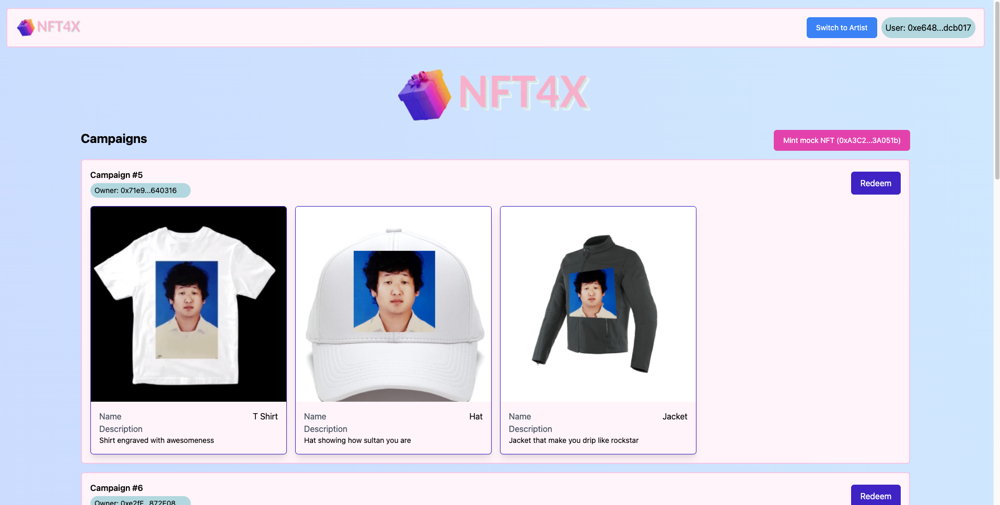

  
   
  <h1>Turn NFT to real-world products</h1>

## TL:DR;

We are looking for some use cases that can extend existed NFT art collection and ended up with "A dApp 💻 for making an existed NFT collection become redeemable token" for anything from hoodie merchandise to tungsten cube.
This project is a submission for Ethglobal's NFTHACK 2022.

> Well, it's 🦄[fill anything here].exchange but we redeem with NFT here.

## Features

- Artist 👨‍🎨 (or any person) can create campaigns, including the collection they want to plug in, name and maximum redeem count per user.
- Redeemer 🧑‍💻 can come to home page, select campaign they want
  to redeem, select item they want to redeem and redeem in exchange for their NFT automatically handle by smart contracts.

## Implementation

- Smart contract including `NFTForX.sol` for main logic on redeemable campaign and its factory contract.
- Web application as user interface for interacting with smart contract.

## Tools

- ⛓ Smart contract : Openzeppelin contracts, Solidity and Alchemy.io
- 💻 Web application : React.js, Moralis and Vercel CI
- 📦 Deployed on Mumbai Polygon Testnet

## Thanks to

- [ETHGlobal](https://ethglobal.com/) for having us participated in #nfthack2022
- [solidity-nextjs-starter](https://github.com/tomhirst/solidity-nextjs-starter) for setting up project
